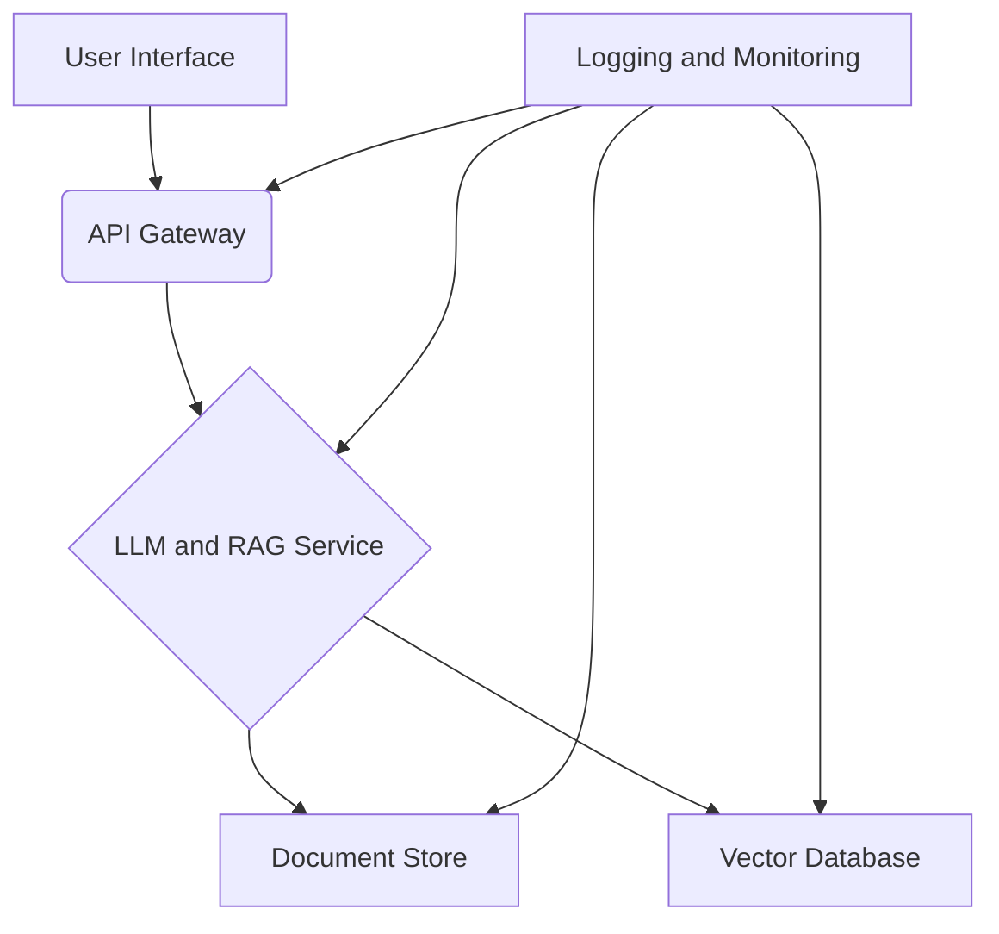

# Implementation Strategy and Technical Architecture

## Introduction

This document outlines the implementation strategy and technical architecture for the internal Legal LLM and RAG system. It provides a high-level overview of the system components, security and compliance framework, integration strategy, and testing and validation plan.

## Technical Architecture

The proposed technical architecture is designed to be secure, scalable, and compliant with Saudi Arabian regulations. It consists of the following key components:

- **User Interface (UI):** A web-based interface for lawyers to interact with the system. The UI will provide a secure and intuitive way to submit queries, review results, and manage documents.
- **API Gateway:** A secure API gateway to manage access to the backend services. The API gateway will handle authentication, authorization, and rate limiting.
- **LLM and RAG Service:** The core of the system, responsible for processing user queries, retrieving relevant documents, and generating responses. This service will be built using a combination of open-source and proprietary technologies.
- **Document Store:** A secure and scalable document store for storing and managing legal documents. The document store will be encrypted at rest and in transit.
- **Vector Database:** A specialized database for storing and querying vector embeddings of legal documents. The vector database will be used to efficiently find relevant documents for RAG.
- **Logging and Monitoring Service:** A centralized logging and monitoring service to track system activity, detect anomalies, and ensure compliance.

### High-Level Architecture Diagram

## Security and Compliance Framework

The security and compliance framework is based on the legal and regulatory requirements identified in Phase 1. It includes the following key elements:

- **Data Governance:** A comprehensive data governance framework to ensure the confidentiality, integrity, and availability of client data.
- **Access Control:** A robust access control system based on the principle of least privilege.
- **Encryption:** End-to-end encryption of all data, both at rest and in transit.
- **Auditing and Monitoring:** Continuous auditing and monitoring of all system activity.
- **Compliance with Saudi Regulations:** Adherence to all relevant Saudi Arabian regulations, including the PDPL, CSCC, and Anti-Cybercrime Law.

## Integration Strategy

The integration strategy is designed to ensure seamless integration with existing legal systems, such as case management systems and document management systems. The following integration points will be supported:

- **Case Management System Integration:** The system will integrate with the firm's existing case management system to provide access to case information and documents.
- **Document Management System Integration:** The system will integrate with the firm's existing document management system to provide access to legal documents and other materials.
- **Single Sign-On (SSO):** The system will support SSO to provide a seamless and secure user experience.

## Testing and Validation Plan

The testing and validation plan is designed to ensure that the system is reliable, accurate, and secure. The following testing activities will be performed:

- **Unit Testing:** Each component of the system will be tested individually to ensure that it functions correctly.
- **Integration Testing:** The components of the system will be tested together to ensure that they work together as expected.
- **System Testing:** The entire system will be tested to ensure that it meets the requirements of the business.
- **Security Testing:** The system will be tested for security vulnerabilities to ensure that it is secure.
- **User Acceptance Testing (UAT):** The system will be tested by a group of users to ensure that it meets their needs.

## Detailed Technical Architecture

### User Interface (UI)
- **Framework:** React with a responsive design to ensure compatibility with both desktop and mobile devices.
- **Authentication:** Integration with the firm's existing identity provider (e.g., Azure AD, Okta) for Single Sign-On (SSO) using OpenID Connect (OIDC) or SAML.
- **Features:**
    - Secure login and user management.
    - Intuitive search interface for submitting natural language queries.
    - Document upload and management capabilities.
    - Display of search results with clear source attribution and confidence scores.
    - User feedback mechanism for rating the quality of search results.

### API Gateway
- **Technology:** A managed API gateway service (e.g., Amazon API Gateway, Azure API Management) to handle routing, authentication, and rate limiting.
- **Security:**
    - JWT-based authentication for all API requests.
    - IP whitelisting to restrict access to authorized networks.
    - Web Application Firewall (WAF) to protect against common web exploits.

### LLM and RAG Service
- **LLM Model:** A state-of-the-art LLM (e.g., GPT-4, Llama 3) fine-tuned on a corpus of legal documents to improve its understanding of legal terminology and concepts.
- **RAG Implementation:**
    - **Document Chunking:** Documents will be split into smaller, semantically meaningful chunks to improve retrieval accuracy.
    - **Embedding Model:** A sentence-transformer model will be used to generate vector embeddings for each document chunk.
    - **Retrieval:** A hybrid search approach will be used, combining vector similarity search with traditional keyword-based search to improve retrieval performance.
- **Hosting:** The LLM and RAG service will be hosted in a secure, private cloud environment within Saudi Arabia to comply with data residency requirements.

### Document Store
- **Technology:** A secure, scalable object storage service (e.g., Amazon S3, Azure Blob Storage).
- **Security:**
    - Encryption at rest using AES-256.
    - Encryption in transit using TLS 1.2 or higher.
    - Access control policies to restrict access to authorized users and services.

### Vector Database
- **Technology:** A managed vector database service (e.g., Pinecone, Weaviate) or a self-hosted solution (e.g., Milvus, Qdrant).
- **Security:**
    - Encryption at rest and in transit.
    - Network isolation to prevent unauthorized access.

### Logging and Monitoring Service
- **Technology:** A centralized logging and monitoring solution (e.g., ELK Stack, Datadog).
- **Features:**
    - Real-time monitoring of system performance and availability.
    - Centralized logging of all system activity for auditing and compliance purposes.
    - Alerting mechanism to notify administrators of any security incidents or performance issues.

## Detailed Security and Compliance Framework

### Data Governance
- **Data Classification:** All data will be classified into three categories: Public, Internal, and Confidential. Access to data will be restricted based on its classification.
- **Data Retention:** A data retention policy will be established to ensure that data is not kept for longer than necessary. The policy will be based on legal and regulatory requirements.
- **Data Disposal:** A secure data disposal process will be implemented to ensure that data is securely deleted when it is no longer needed.

### Access Control
- **Role-Based Access Control (RBAC):** Access to the system will be based on the user's role. Each role will have a set of permissions that determine what actions the user can perform.
- **Privileged Access Management (PAM):** A PAM solution will be used to manage and monitor access to privileged accounts.
- **Access Reviews:** Regular access reviews will be conducted to ensure that users only have the access they need.

### Encryption
- **Data at Rest:** All data at rest will be encrypted using AES-256. Encryption keys will be managed using a key management service (KMS).
- **Data in Transit:** All data in transit will be encrypted using TLS 1.2 or higher.

### Auditing and Monitoring
- **Audit Logs:** All system activity will be logged to a central audit log. The audit log will be reviewed regularly to detect any suspicious activity.
- **Security Information and Event Management (SIEM):** A SIEM solution will be used to collect, analyze, and correlate security events from across the system.
- **Intrusion Detection and Prevention System (IDPS):** An IDPS will be used to detect and prevent network-based attacks.

### Compliance with Saudi Regulations
- **PDPL:** The system will be designed to comply with the requirements of the Saudi Personal Data Protection Law (PDPL). This includes obtaining consent from data subjects, providing them with access to their data, and protecting their data from unauthorized access.
- **CSCC:** The system will be designed to comply with the requirements of the Critical Systems Cybersecurity Controls (CSCC). This includes implementing a comprehensive set of security controls to protect the system from cyber attacks.
- **Anti-Cybercrime Law:** The system will be designed to comply with the requirements of the Anti-Cybercrime Law. This includes implementing measures to prevent the system from being used for criminal purposes.

## Detailed Integration Strategy

### Case Management System Integration
- **API-based Integration:** The system will integrate with the firm's case management system (e.g., Clio, PracticePanther) via its public API.
- **Data Synchronization:** A one-way data synchronization process will be implemented to pull case information and documents from the case management system into the Legal LLM/RAG system. This will ensure that the system always has access to the latest case data.
- **Security:** All API communication will be encrypted using TLS 1.2 or higher. API keys will be securely stored and rotated regularly.

### Document Management System Integration
- **API-based Integration:** The system will integrate with the firm's document management system (e.g., iManage, NetDocuments) via its public API.
- **Document Indexing:** A real-time document indexing process will be implemented to ensure that new and updated documents are immediately available for search.
- **Security:** All API communication will be encrypted using TLS 1.2 or higher. API keys will be securely stored and rotated regularly.

### Single Sign-On (SSO)
- **Identity Provider (IdP) Integration:** The system will integrate with the firm's existing IdP (e.g., Azure AD, Okta) to provide a seamless and secure user experience.
- **Authentication Protocol:** The system will support both OpenID Connect (OIDC) and SAML for SSO.
- **User Provisioning:** A System for Cross-domain Identity Management (SCIM) integration will be implemented to automate user provisioning and de-provisioning.

## Detailed Testing and Validation Plan

### Unit Testing
- **Scope:** Each individual component (e.g., UI components, API endpoints, data processing scripts) will be tested in isolation.
- **Tools:** Jest and React Testing Library for the frontend; Pytest for the backend.
- **Goal:** To ensure that each component functions as expected and to catch bugs early in the development process.

### Integration Testing
- **Scope:** The interaction between different components of the system will be tested (e.g., UI to API gateway, API gateway to LLM service).
- **Tools:** Supertest for API testing; Cypress for end-to-end testing.
- **Goal:** To ensure that the different components of the system work together correctly and to identify any issues with data flow or communication.

### System Testing
- **Scope:** The entire system will be tested as a whole to ensure that it meets the business requirements.
- **Methodology:** A black-box testing approach will be used, where the tester has no knowledge of the internal workings of the system.
- **Goal:** To validate that the system meets the functional and non-functional requirements and to identify any defects that were not caught in unit or integration testing.

### Security Testing
- **Scope:** The system will be tested for security vulnerabilities, including those listed in the OWASP Top 10.
- **Methodology:** A combination of static application security testing (SAST), dynamic application security testing (DAST), and manual penetration testing will be used.
- **Goal:** To identify and remediate any security vulnerabilities before the system is deployed to production.

### User Acceptance Testing (UAT)
- **Scope:** A group of end-users (lawyers) will test the system to ensure that it meets their needs and is easy to use.
- **Methodology:** Users will be given a set of test cases to execute, and they will provide feedback on the system's usability and functionality.
- **Goal:** To ensure that the system is fit for purpose and to get buy-in from the end-users before the system is rolled out to the entire firm.

